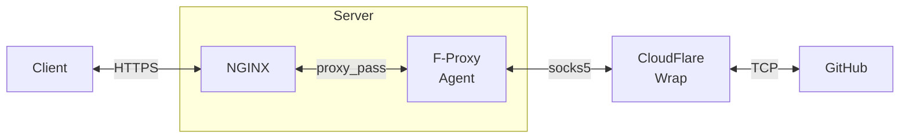

# F-Proxy

F-Proxy is a simple solution for forward proxying over CloudFlare Wrap.

## Graph

```mermaid
flowchart LR
    C[Client] <--HTTPS--> NGX
    W[CloudFlare<br/>Wrap]
    subgraph B[Server]
        NGX[NGINX]<--proxy_pass-->A[F-Proxy<br/>Agent]
        
    end
    A<--socks5-->W
    W<--TCP-->G
    G[GitHub]
```
