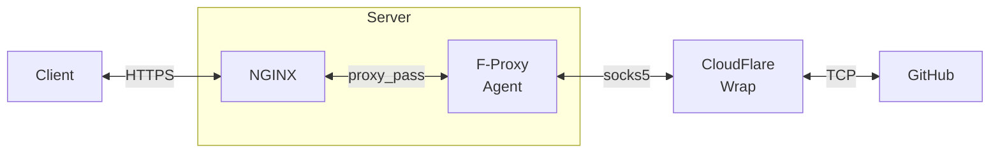

# F-Proxy

F-Proxy is a simple solution for forward proxying over CloudFlare Wrap.

## Component

- [F-Proxy Agent](https://github.com/FastGitORG/F-Proxy-Agent)
- [CloudFlare WARP Client (Official)](https://developers.cloudflare.com/warp-client/get-started/linux/)

F-Proxy Agent is a simple forward proxy server based on [TachibanaSuzume/SNIProxyGo](https://github.com/TachibanaSuzume/SNIProxyGo).
It works as the core of F-Proxy. Some features have been added to make sure it is able to work with CloudFlare WARP and NGINX fluently.
The agent is licensed under GPL-3.

NOTE: This repository *does not* contain any binary files but some scripts to download and install them.

## Graph

